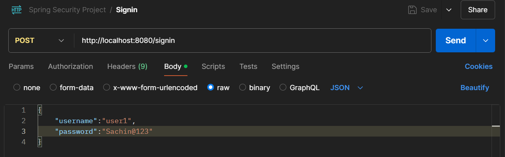
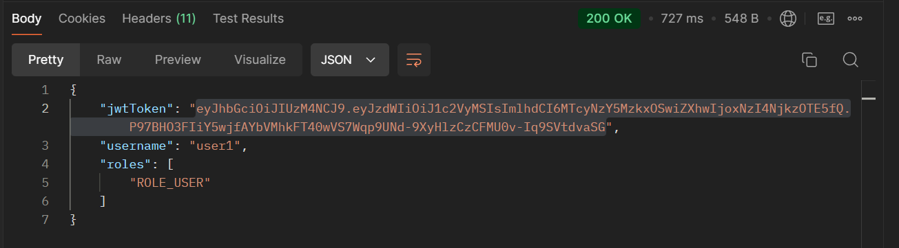
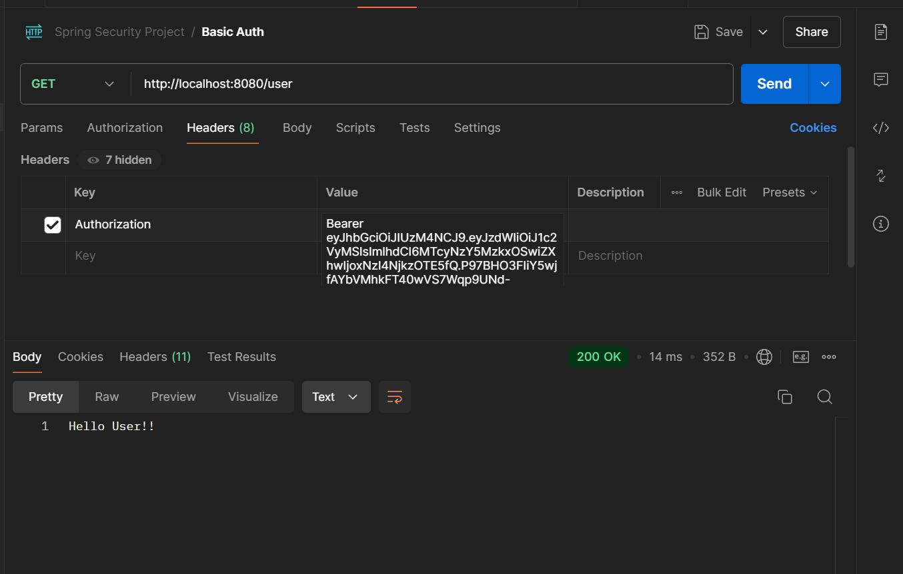

# Demo Project for Spring Security
This project is for understanding and getting hands 
on spring security

Files needed to create Jwt Token:

Creating and Using JWT token:

* Requesting JWT token by using the "/signin" endpoint

  
* Getting the Jwt Token in response

    

* Using the token to make request by using NoAuth in authorisation
* 